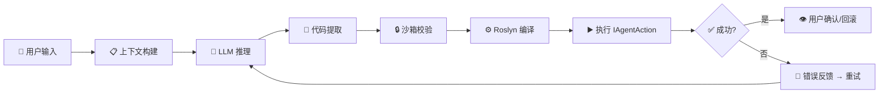

<h1 align="center">UI Prefab Builder</h1>

<p align="center">
  <strong>Unity Editor 内嵌 AI Agent —— 用自然语言构建 UGUI</strong>
</p>

<p align="center">
  <a href="https://unity.com/releases/editor/whats-new/2021.3.0"></a>
  
  
  
  
</p>

<p align="center">
  <a href="#-features">Features</a> •
  <a href="#-quick-start">Quick Start</a> •
  <a href="#-how-it-works">How It Works</a> •
  <a href="#-skills-system">Skills</a> •
  <a href="#-configuration">Configuration</a> •
  <a href="#-extending">Extending</a>
</p>

---

## 📸 Preview

<p align="center">
  
</p>

---

## ✨ Features

| | Feature | Description |
|---|---------|-------------|
| 🤖 | **自然语言驱动** | 描述需求，AI 自动生成并执行 UI 构建代码 |
| ⚡ | **动态编译执行** | LLM 输出 C# 代码 → Roslyn 编译 → 沙箱校验 → 即时执行 |
| 🔒 | **安全沙箱** | 静态 API 白名单 + 命名空间限制，阻止危险操作 |
| 🧠 | **ReAct 循环** | 上下文收集 → LLM 推理 → 代码提取 → 编译 → 执行 → 观察 → 重试/确认 |
| 📡 | **流式响应** | SSE 实时流式输出，支持 Thinking/Reasoning 展示 |
| 📚 | **Skills 系统** | Anthropic 标准 Skill 格式，意图匹配自动注入相关文档 |
| 💾 | **会话管理** | 多会话保存/加载/导出 Markdown |
| 🎯 | **上下文感知** | `@Scene` / `@Selection` 注入当前场景/选中对象的层级信息 |

---

## 🚀 Quick Start

### 配置

1. 打开 **Window → UI Prefab Builder**
2. 在右侧 Settings 面板填入：
   - **Base URL** — OpenAI 兼容 API 地址（如 `https://api.openai.com/v1`）
   - **API Key** — 你的 API 密钥
   - **Model** — 模型名称（如 `gpt-4o`、`claude-sonnet-4-20250514`）

### 使用

```
1. 在 Hierarchy 中选中目标 GameObject（或不选，从场景全局操作）
2. 在聊天输入框输入需求，如："创建一个弹窗，包含标题栏、关闭按钮和竖向按钮列表"
3. 按 Send（或 Ctrl+Enter）发送
4. 观察 AI 思考、代码生成、编译执行的全过程
5. 满意点 Confirm，不满意点 Undo 回滚
```

---

## 🔬 How It Works



### 核心架构

```
┌─────────────────────────────────────────────────────────┐
│                    BuilderWindow (UI)                     │
├──────────┬──────────────────────────────┬───────────────┤
│ Console  │         Chat Panel           │   Settings    │
│  Panel   │  - Streaming messages        │   - LLM      │
│  - Logs  │  - Thinking display          │   - Agent    │
│  - Filter│  - @Scene / @Selection       │   - Skills   │
└──────────┴──────────┬───────────────────┴───────────────┘
                      │
              ┌───────▼───────┐
              │  AgentEngine  │  ← 状态机: Idle → Building → LLM → Extract → Compile → Execute → Confirm
              └───────┬───────┘
        ┌─────────────┼─────────────────┐
        ▼             ▼                 ▼
┌──────────────┐ ┌──────────┐ ┌─────────────────┐
│ContextBuilder│ │LLMClient │ │DynamicCompiler  │
│- Scene tree  │ │- SSE     │ │- Roslyn/csc     │
│- Selection   │ │- Retry   │ │- SandboxValidator│
│- Skills docs │ │- Timeout │ │- CodeExtractor  │
└──────────────┘ └──────────┘ └────────┬────────┘
                                       ▼
                              ┌─────────────────┐
                              │  Helper APIs    │
                              │  (Undo-safe)    │
                              ├─────────────────┤
                              │ • UICreator     │
                              │ • LayoutHelper  │
                              │ • PrefabHelper  │
                              │ • AssetFinder   │
                              │ • SceneHelper   │
                              │ • ...           │
                              └─────────────────┘
```

### Agent 状态机

| 状态 | 说明 |
|------|------|
| `Idle` | 等待用户输入 |
| `BuildingContext` | 收集场景/选中对象/Skill 上下文 |
| `WaitingForLLM` | 等待 LLM 流式响应 |
| `ExtractingCode` | 从响应中提取 C# 代码块 |
| `Compiling` | Roslyn 编译 + 沙箱检查 |
| `Executing` | 在主线程执行 `IAgentAction.Execute()` |
| `ObservingResult` | 对比执行前后 Hierarchy 差异 |
| `WaitingConfirmation` | 等待用户 Confirm / Undo |
| `Error` | 错误状态，可重试 |

---

## 📚 Skills System

Skills 使用 **Anthropic 标准格式**（`SKILL.md` + 可选 `references/`），通过意图匹配自动注入到 LLM Prompt。

### 内置 Skills（8 个）

| Skill | 功能 |
|-------|------|
| `creating-ui-elements` | Canvas、Panel、Button、Text、Image、InputField、ScrollView 等 |
| `finding-assets` | AssetDatabase 搜索 Sprite/Font/Prefab 等资源 |
| `managing-rect-transform` | 锚点、大小、位置、旋转 |
| `modifying-ui-properties` | 颜色、图片、文本、CanvasGroup |
| `applying-layout-groups` | Vertical / Horizontal / Grid 布局组 |
| `managing-prefabs` | 创建、实例化、应用 Prefab |
| `managing-scenes` | 场景保存、对象查找 |
| `inspecting-hierarchy` | 描述层级结构和组件信息 |

### 自定义 Skill

```
Packages/com.indey.uiprefabbuilder/Skills~/
└── my-custom-skill/
    ├── SKILL.md          ← YAML frontmatter + 操作指南
    └── references/       ← 可选的参考代码片段
        └── example.cs
```

`SKILL.md` 模板：

```yaml
---
name: my-custom-skill
description: 简短描述这个 Skill 的用途
---

# 操作指南

当用户想要 ... 时，按以下步骤操作：
...
```

---

## ⚙️ Configuration

| 设置项 | 说明 | 默认值 |
|--------|------|--------|
| Base URL | OpenAI 兼容 API 端点 | `https://api.openai.com/v1` |
| Model | 模型标识符 | `gpt-4o-mini` |
| API Key | API 密钥（加密存储） | — |
| Request Timeout | 请求超时秒数 | 120 |
| Max Retries | 编译/执行失败最大重试次数 | 5 |
| Auto Execute | 是否自动执行（无需确认） | `false` |

---

## 🔧 Extending

### 实现自定义 Helper API

```csharp
public static class MyCustomHelper
{
    public static void DoSomething(GameObject target)
    {
        Undo.RecordObject(target, "My Custom Action");
        // 你的逻辑...
    }
}
```

将类放入 `Editor/Skills/` 目录，在对应 Skill 的 `SKILL.md` 中引用即可。

### IAgentAction 接口

LLM 生成的代码必须实现此接口：

```csharp
public interface IAgentAction
{
    string ActionName { get; }
    string Description { get; }
    ActionResult Execute(ActionContext context);
}
```

`ActionContext` 提供：
- `SelectedObject` — 当前选中的 GameObject
- `Canvas` — 场景中的 Canvas
- `ActionLog` — 执行日志记录

---

## 🏗️ Technical Highlights

<table>
<tr>
<td width="50%">

### 🧬 Code-as-Action 范式

区别于传统 JSON Tool Calling，本项目让 LLM 直接输出 **C# 代码**实现 `IAgentAction` 接口。这赋予了：
- 完整的编程灵活性（循环、条件、组合逻辑）
- 类型安全的 Unity API 调用
- 自然的错误信息反馈

</td>
<td width="50%">

### ⚡ 编辑器内动态编译

利用 Unity 内置的 Roslyn/csc 直接编译 LLM 输出的代码：
- 零外部依赖，无需额外 SDK
- 自动引用所有已加载程序集
- 编译→校验→执行全流程 < 2s

</td>
</tr>
<tr>
<td>

### 🔒 多层安全机制

```
Layer 1: System Prompt 规则约束
Layer 2: SandboxValidator 静态分析
Layer 3: 命名空间白名单限制
Layer 4: Unity Undo 完整回滚
Layer 5: 用户确认门控
```

</td>
<td>

### 🧠 Observe-Retry 智能循环

编译/运行失败时自动将错误信息 + Hierarchy 差异反馈给 LLM，附带定向修复提示：
- 常见 API 误用纠正
- 类型签名提示
- 最多 5 次自动重试

</td>
</tr>
</table>

---

## 📦 Dependencies

| 包 | 版本 | 用途 |
|----|------|------|
| `com.unity.nuget.newtonsoft-json` | 3.0.2 | JSON 序列化（LLM 请求/会话） |
| `com.unity.ugui` | — | Unity UI 组件 |
| TextMeshPro | ≥3.0 | 文本组件（可选，自动检测） |

---

## 📋 Roadmap

- [ ] 多模态支持（截图/设计稿 → UI）
- [ ] 项目级约束配置（设计规范、命名规则）
- [ ] Prefab 模板库
- [ ] 自动执行模式完善
- [ ] 更多内置 Skills（动画、事件绑定等）
- [ ] 单元测试覆盖

---

## 📄 License

MIT License - 详见 [LICENSE](LICENSE)

---

<p align="center">
  <sub>Built with ❤️ by <strong>Indey</strong> | Powered by LLM + Unity Editor</sub>
</p>
