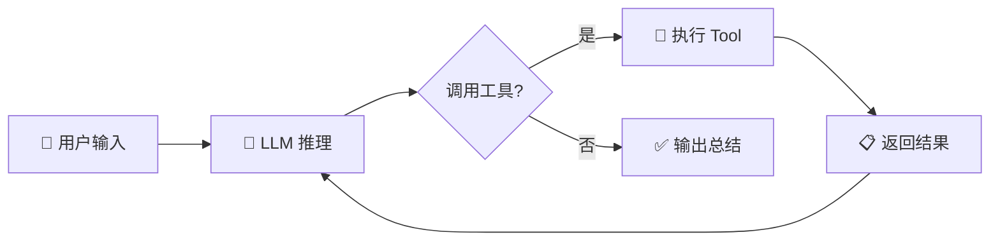

<h1 align="center">UI Prefab Builder</h1>

<p align="center">
  <strong>Unity Editor 内嵌 AI Agent —— 用自然语言构建 UGUI</strong>
</p>

<p align="center">
  <a href="https://unity.com/releases/editor/whats-new/2021.3.0"></a>
  
  
  
  
</p>

<p align="center">
  <a href="#-features">Features</a> •
  <a href="#-quick-start">Quick Start</a> •
  <a href="#-how-it-works">How It Works</a> •
  <a href="#-tool-system">Tools</a> •
  <a href="#-configuration">Configuration</a> •
  <a href="#-extending">Extending</a>
</p>

---

## 📸 Preview

<p align="center">
  
</p>

---

## ✨ Features

| | Feature | Description |
|---|---------|-------------|
| 🤖 | **自然语言驱动** | 描述需求，AI 通过工具调用逐步构建 UI |
| 🔧 | **Tool Calling 架构** | 基于 OpenAI Function Calling 标准，27 个结构化工具覆盖完整 UGUI 工作流 |
| 🔄 | **Agentic Loop** | Think → Tool Call → Observe → Think 多步循环，自主规划和执行 |
| 📡 | **流式响应** | SSE 实时流式输出，支持 Thinking/Reasoning 展示 |
| 🧰 | **丰富的工具集** | 资源搜索、元素创建、属性修改、布局管理、Prefab 导出、层级检查 |
| 💾 | **会话管理** | 多会话保存/加载/导出 Markdown |
| 🔒 | **安全兜底** | `execute_code` 工具支持动态编译 C# 代码，应对工具未覆盖的复杂场景 |
| ↩️ | **Undo 支持** | 所有 UI 操作注册 Unity Undo，可随时回滚 |

---

## 🚀 Quick Start

### 配置

1. 打开 **Window → UI Prefab Builder**
2. 在右侧 Settings 面板填入：
   - **Base URL** — OpenAI 兼容 API 地址（如 `https://api.openai.com/v1`）
   - **API Key** — 你的 API 密钥
   - **Model** — 模型名称（如 `gpt-4o`、`claude-sonnet-4-20250514`）

### 使用

```
1. 在聊天输入框输入需求，如："创建一个弹窗，包含标题栏、关闭按钮和竖向按钮列表"
2. 按 Send（或 Ctrl+Enter）发送
3. 观察 AI 自主搜索资源 → 创建元素 → 设置属性 → 检查结果的全过程
4. 满意后继续下一个任务，不满意点 Undo 回滚
```

### 示例指令

```
"搜索项目里的按钮 Sprite，创建一排三个按钮"
"创建一个带背景的设置面板，包含音量滑条和开关"
"给现有的 Canvas 添加一个底部导航栏"
"把场景里的 Dialog 保存为 Prefab 到 Assets/Prefabs/"
```

---

## 🔬 How It Works



### 核心架构

```
┌──────────────────────────────────────────────────────────┐
│                    BuilderWindow (UI)                      │
├──────────┬───────────────────────────────┬────────────────┤
│ Console  │         Chat Panel            │   Settings     │
│  Panel   │  - Streaming messages         │   - LLM        │
│  - Logs  │  - Thinking display           │   - Agent      │
│  - Filter│  - Tool call results          │                │
└──────────┴──────────┬────────────────────┴────────────────┘
                      │
              ┌───────▼───────┐
              │  AgentEngine  │  ← Agentic Loop: Thinking ↔ CallingTool → Completed
              └───────┬───────┘
        ┌─────────────┼─────────────────┐
        ▼             ▼                 ▼
┌──────────────┐ ┌──────────┐ ┌─────────────────┐
│ ToolRegistry │ │LLMClient │ │ MessageHistory  │
│- 27 tools    │ │- SSE     │ │- System/User/   │
│- Definitions │ │- Tool    │ │  Assistant/Tool  │
│- Executor    │ │  Calling │ │  messages        │
└──────┬───────┘ └──────────┘ └─────────────────┘
       ▼
┌─────────────────┐     ┌─────────────────┐
│  ToolExecutor   │────→│  Helper APIs    │
│  - JSON → Call  │     │  (Undo-safe)    │
│  - Result → JSON│     ├─────────────────┤
└─────────────────┘     │ • UICreator     │
                        │ • LayoutHelper  │
                        │ • PrefabHelper  │
                        │ • AssetFinder   │
                        │ • SceneHelper   │
                        │ • ComponentHelper│
                        │ • RectTransform │
                        │   Helper        │
                        │ • Hierarchy     │
                        │   Inspector     │
                        └─────────────────┘
```

### Agent 工作循环

| 阶段 | 说明 |
|------|------|
| **Thinking** | 将消息历史 + 工具定义发给 LLM，等待推理结果 |
| **CallingTool** | 解析 LLM 返回的 `tool_calls`，逐个执行并收集结果 |
| **Thinking** (再次) | 工具结果回传 LLM，决定下一步操作 |
| **Completed** | LLM 不再调用工具，输出最终总结 |

---

## 🔧 Tool System

Agent 通过 **OpenAI Function Calling** 标准与 LLM 交互，共 27 个内置工具：

### 资源探索

| 工具 | 功能 |
|------|------|
| `search_assets` | 通过 AssetDatabase 搜索项目资源（Sprite、Prefab、Font 等） |
| `get_asset_info` | 获取指定路径资源的详细信息 |

### 场景感知

| 工具 | 功能 |
|------|------|
| `get_scene_overview` | 获取当前场景所有 Canvas 和 UI 结构概览 |
| `find_by_name` | 按名称查找场景中的 GameObject |
| `inspect_hierarchy` | 描述 GameObject 的层级树 |
| `inspect_components` | 列出 GameObject 上所有组件及其属性 |

### UI 创建

| 工具 | 功能 |
|------|------|
| `create_canvas` | 创建 Canvas（可选 RenderMode） |
| `create_panel` | 创建面板（Image，自动 StretchAll） |
| `create_button` | 创建按钮（Button + Text 子节点） |
| `create_text` | 创建文本（自动检测 TextMeshPro） |
| `create_image` | 创建图片（可指定 Sprite 路径） |
| `create_inputfield` | 创建输入框 |
| `create_slider` | 创建滑动条 |
| `create_toggle` | 创建开关 |
| `create_scrollview` | 创建滚动视图（ScrollRect + Viewport + Content） |

### 属性修改

| 工具 | 功能 |
|------|------|
| `set_anchor` | 设置锚点预设（10 种预设） |
| `set_size` | 设置 RectTransform 大小 |
| `set_position` | 设置 RectTransform 位置 |
| `set_image_sprite` | 设置/更换 Image 的 Sprite |
| `set_image_color` | 设置 Image 颜色 |
| `set_text` | 设置 Text/TMP 文本内容 |
| `add_canvas_group` | 添加 CanvasGroup（透明度、交互控制） |

### 布局管理

| 工具 | 功能 |
|------|------|
| `add_vertical_layout` | 添加垂直布局组 |
| `add_horizontal_layout` | 添加水平布局组 |
| `add_grid_layout` | 添加网格布局组 |
| `add_layout_element` | 添加 LayoutElement 控制子元素尺寸 |

### Prefab & 代码

| 工具 | 功能 |
|------|------|
| `save_as_prefab` | 将场景 GameObject 保存为 Prefab |
| `execute_code` | 动态编译执行 C# 代码（兜底方案） |

---

## ⚙️ Configuration

| 设置项 | 说明 | 默认值 |
|--------|------|--------|
| Base URL | OpenAI 兼容 API 端点 | `https://api.openai.com/v1` |
| Model | 模型标识符 | `gpt-4o-mini` |
| API Key | API 密钥（加密存储） | — |
| Request Timeout | 请求超时秒数 | 60 |
| Max Retries | 最大重试次数 | 5 |
| Auto Execute | 是否自动执行 | `true` |

---

## 🔧 Extending

### 添加自定义工具

1. 在 `ToolDefinitions.cs` 中添加工具定义（OpenAI function schema）：

```csharp
Def("my_tool",
    "Description of what this tool does.",
    Props(
        P("param1", "string", "Parameter description", true),
        P("param2", "number", "Optional param", false, 42)
    )),
```

2. 在 `ToolExecutor.cs` 的 `ExecuteInternal` 中添加 case 分支：

```csharp
case "my_tool": return DoMyTool(args);
```

3. 实现执行方法：

```csharp
private string DoMyTool(JObject args)
{
    var param1 = Str(args, "param1");
    // 你的逻辑...
    return Ok("Tool executed successfully.");
}
```

### execute_code 兜底

当内置工具无法满足需求时，`execute_code` 工具允许 LLM 生成 C# 代码动态编译执行。代码必须实现 `IAgentAction` 接口：

```csharp
public interface IAgentAction
{
    string ActionName { get; }
    string Description { get; }
    ActionResult Execute(ActionContext context);
}
```

### Skills 文档系统

Skills 使用 **Anthropic 标准格式**（`SKILL.md` + 可选 `references/`）。内置 8 个 Skills 作为知识库：

| Skill | 功能 |
|-------|------|
| `creating-ui-elements` | UI 元素创建指南 |
| `finding-assets` | 资源搜索模式 |
| `managing-rect-transform` | 锚点与变换操作 |
| `modifying-ui-properties` | 属性修改方法 |
| `applying-layout-groups` | 布局组用法 |
| `managing-prefabs` | Prefab 工作流 |
| `managing-scenes` | 场景操作 |
| `inspecting-hierarchy` | 层级检查 |

---

## 🏗️ Technical Highlights

<table>
<tr>
<td width="50%">

### 🔧 Tool Calling 架构

基于 OpenAI Function Calling 标准，Agent 通过结构化工具与 Unity 交互：
- 27 个类型安全的工具，覆盖 UGUI 全流程
- JSON Schema 参数校验，减少 LLM 幻觉
- 工具结果实时反馈，支持多步规划

</td>
<td width="50%">

### 🔄 Agentic Loop

Think↔Act 多步循环，而非单次代码生成：
- LLM 自主决定调用哪些工具、按什么顺序
- 每步观察结果后动态调整策略
- 单次任务最多 30 步，防止无限循环

</td>
</tr>
<tr>
<td>

### 📡 SSE 流式 + Tool Calls

```
LLM Response Stream
├── content delta     → 实时显示文字
├── thinking delta    → 推理过程展示
└── tool_calls delta  → 增量拼装工具调用
    ├── id + name
    └── arguments (chunked)
```

</td>
<td>

### 🔒 安全机制

```
Layer 1: System Prompt 行为约束
Layer 2: 工具参数类型校验
Layer 3: Unity Undo 完整回滚
Layer 4: execute_code 沙箱校验
Layer 5: 30 步上限防止失控
```

</td>
</tr>
</table>

---

## 📦 Dependencies

| 包 | 版本 | 用途 |
|----|------|------|
| `com.unity.nuget.newtonsoft-json` | 3.0.2 | JSON 序列化（LLM 请求 / Tool Calling / 会话） |
| `com.unity.ugui` | — | Unity UI 组件 |
| TextMeshPro | ≥3.0 | 文本组件（可选，自动检测） |

---

## 📋 Roadmap

- [ ] 多模态支持（截图/设计稿 → UI）
- [ ] 项目级约束配置（设计规范、命名规则）
- [ ] Prefab 模板库 & 常用 UI 一键生成
- [ ] 自定义工具插件化注册
- [ ] 更多内置工具（动画、事件绑定、Navigation 等）
- [ ] MCP Server 模式（从外部 IDE 调用）
- [ ] 单元测试覆盖

---

## 📄 License

MIT License - 详见 [LICENSE](LICENSE)

---

<p align="center">
  <sub>Built with ❤️ by <strong>Indey</strong> | Powered by LLM Tool Calling + Unity Editor</sub>
</p>
