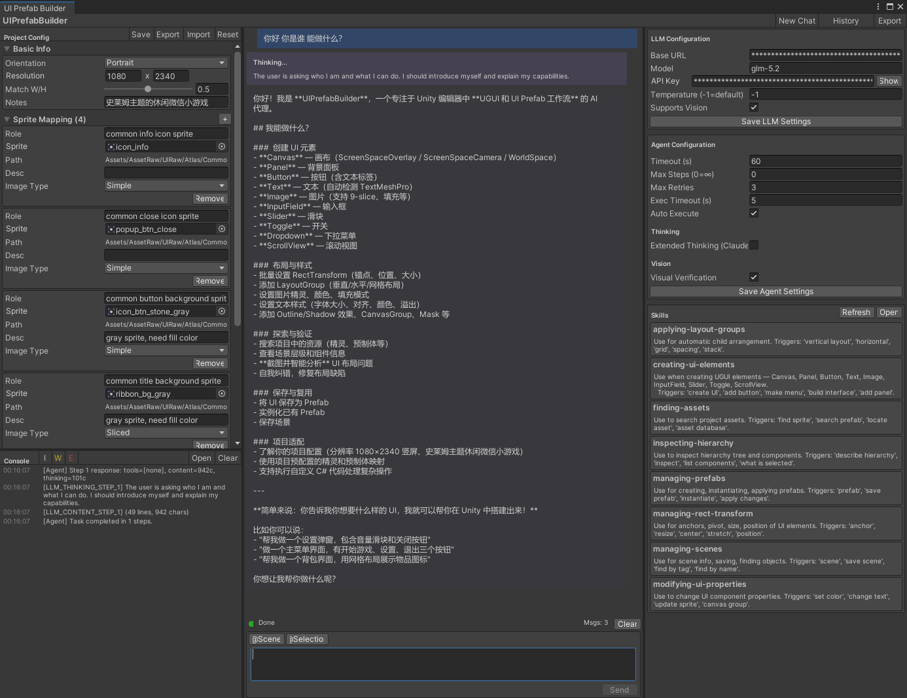
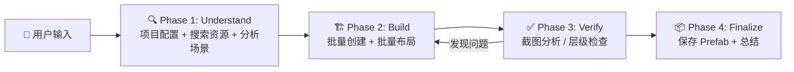

<h1 align="center">UI Prefab Builder</h1>

<p align="center">
  <strong>Unity Editor 内嵌 AI Agent —— 用自然语言构建 UGUI</strong>
</p>

<p align="center">
  <a href="https://unity.com/releases/editor/whats-new/2021.3.0"></a>
  
  
  
  
</p>

<p align="center">
  <a href="#-features">Features</a> •
  <a href="#-installation">Installation</a> •
  <a href="#-quick-start">Quick Start</a> •
  <a href="#-how-it-works">How It Works</a> •
  <a href="#-tool-system">Tools</a> •
  <a href="#-extending">Extending</a>
</p>

---

## 📸 Preview

<p align="center">
  
</p>

---

## ✨ Features

| | Feature | Description |
|---|---------|-------------|
| 🤖 | **自然语言驱动** | 描述需求，AI 自主规划并执行完整 UI 构建流程 |
| 🔧 | **50+ 结构化工具** | 基于 OpenAI Function Calling，覆盖资源搜索、批量创建、属性设置、布局、特效、Prefab 全流程 |
| 📐 | **项目级配置** | Sprite/Prefab 映射、组件类型覆盖、设计分辨率，自动注入 Agent Prompt |
| ⚡ | **Batch-First 架构** | `create_batch` 一次创建整棵 UI 树，`set_rect_transform_batch` 一次定位所有元素 |
| 🔄 | **4 阶段工作流** | Understand → Build → Verify → Finalize，Agent 自主遵循最佳实践 |
| 📸 | **视觉验证** | 截图 Game View → Vision 模型分析布局问题 → 自动修复（需支持 Vision 的模型） |
| 🪞 | **通用反射引擎** | `set_component_property` 可通过反射设置任意组件的任意属性 |
| 📡 | **流式响应** | SSE 实时流式输出，支持 Thinking/Extended Thinking 展示 |
| 💾 | **会话管理** | 多会话保存/加载/导出，每个会话独立日志文件 |
| 🧠 | **上下文压缩** | 自动截断/摘要历史工具结果，长任务不会 token 溢出 |
| ↩️ | **Undo 支持** | 所有 UI 操作注册 Unity Undo，可随时回滚 |

---

## 📥 Installation

### 方式一：Git URL（推荐）

打开 Unity 的 **Window → Package Manager → + → Add package from git URL**，输入：

```
https://github.com/Wonderland6627/UIPrefabBuilder.git?path=Packages/com.indey.uiprefabbuilder
```

如需锁定版本，可追加 `#v版本号`：

```
https://github.com/Wonderland6627/UIPrefabBuilder.git?path=Packages/com.indey.uiprefabbuilder#v0.1.0
```

### 方式二：手动编辑 manifest.json

编辑项目中 `Packages/manifest.json`，在 `dependencies` 中添加：

```json
{
  "dependencies": {
    "com.indey.uiprefabbuilder": "https://github.com/Wonderland6627/UIPrefabBuilder.git?path=Packages/com.indey.uiprefabbuilder",
    ...
  }
}
```

> **环境要求：** Unity 2021.3+，Git 已安装并加入系统 PATH。

---

## 🚀 Quick Start

### 1. 配置 LLM

1. 打开 **Window → UI Prefab Builder**
2. 在右侧 Settings 面板填入：
   - **Base URL** — OpenAI 兼容 API 地址（如 `https://api.openai.com/v1`）
   - **API Key** — 你的 API 密钥
   - **Model** — 模型名称（如 `gpt-4o`、`claude-sonnet-4-20250514`）

### 2. 配置项目规范（推荐）

左侧面板 **Project Config** 中设置项目约定，保存到 `ProjectSettings/UIPrefabBuilderConfig.json`：

- **Basic Info** — 横/竖屏、设计分辨率、CanvasScaler Match W/H、项目备注
- **Sprite Mapping** — 角色名 → Sprite 路径（如 `confirm_button` → `Assets/Sprites/UI/btn_green.png`）
- **Prefab Mapping** — 角色名 → Prefab 路径（Agent 优先 `instantiate_prefab` 而非从零创建）
- **Component Overrides** — 指定 Text/Button/Image/InputField 使用的组件类型（如 TMP）

配置会自动注入 Agent System Prompt，创建 Canvas 时也会应用设计分辨率。

### 3. 开始构建

```
1. 在聊天输入框输入需求，如："创建一个弹窗，包含标题栏、关闭按钮和竖向按钮列表"
2. 按 Send（或 Ctrl+Enter）发送
3. 观察 AI 四阶段工作流：搜索资源 → 批量创建 → 验证修复 → 总结交付
4. 满意后继续下一个任务，不满意点 Undo 回滚
```

### 示例指令

```
"搜索项目里所有 dialog 相关的 Sprite，创建一个设置弹窗"
"批量创建 3x4 的物品网格，每格包含图标和数量文字"
"给现有的 Canvas 添加一个底部导航栏，包含 4 个按钮"
"检查场景里的 ScrollView 结构，修复布局问题"
"把 SettingsPanel 保存为 Prefab 到 Assets/Prefabs/"
```

---

## 🔬 How It Works

### 4 阶段工作流



### 核心架构

```
┌──────────────────────────────────────────────────────────┐
│                    BuilderWindow (UI)                      │
├──────────┬───────────────────────────────┬────────────────┤
│ Project  │         Chat Panel            │   Settings     │
│ Config + │  - Streaming messages         │   - LLM        │
│ Console  │  - Thinking display           │   - Vision     │
│  Panel   │  - Tool call results          │   - Thinking   │
└──────────┴──────────┬────────────────────┴────────────────┘
                      │
              ┌───────▼───────┐
              │  AgentEngine  │  ← 4-Phase Agentic Loop
              └───────┬───────┘
        ┌─────────────┼──────────────────┐
        ▼             ▼                  ▼
┌──────────────┐ ┌───────────┐ ┌──────────────────┐
│ ToolRegistry │ │ LLMClient │ │ MessageHistory   │
│- 50+ tools   │ │- SSE      │ │- Multimodal      │
│- Definitions │ │- Tool Call│ │- Context          │
│- Executor    │ │- Vision   │ │  Compression     │
└──────┬───────┘ └───────────┘ └──────────────────┘
       │                    ▲
       ▼                    │ BuildPromptSection()
┌─────────────────┐   ┌─────────────────┐
│  ToolExecutor   │   │  ProjectConfig  │
│  - Batch ops    │   │  - Sprite map   │
│  - Reflection   │   │  - Prefab map   │
│  - Screenshot   │   │  - Components   │
└───────┬─────────┘   └─────────────────┘
        ▼
┌──────────────────┐
│  Helper APIs     │
│  (Undo-safe)     │
├──────────────────┤
│ • UICreator      │  ← 读取 ProjectConfig 分辨率/组件类型
│ • ComponentHelper│
│ • LayoutHelper   │
│ • AssetFinder    │
│ • PrefabHelper   │
│ • SceneHelper    │
│ • HierarchyInsp. │
└──────────────────┘
```

### Agent 循环

| 阶段 | 说明 |
|------|------|
| **Thinking** | 消息历史 + 50+ 工具定义 + 项目配置发给 LLM，等待推理 |
| **CallingTool** | 执行 `tool_calls`，收集结果，连续失败自动注入修复提示 |
| **Thinking** (再次) | 工具结果 + 可选截图回传 LLM，动态调整策略 |
| **Completed** | 不再调用工具，输出最终总结 |

步数上限可配置（默认无限制，硬上限 500 步安全阀）。

---

## 🔧 Tool System

共 **50+ 内置工具**，按 OpenAI Function Calling 标准定义：

### 资源探索

| 工具 | 功能 |
|------|------|
| `search_assets` | AssetDatabase 类型搜索（`t:Sprite`、`t:Prefab`） |
| `search_assets_glob` | 文件名 Glob 模式搜索（`*popup*`、`btn_*_lg*`） |
| `get_asset_info` | 获取资源详情（尺寸、9-slice border、pivot 等） |
| `get_project_config` | 获取项目配置（设计规范、Sprite/Prefab 映射、组件覆盖） |

### UI 创建

| 工具 | 功能 |
|------|------|
| `create_batch` | **批量创建**多个 UI 元素（推荐，单次调用创建整棵 UI 树） |
| `create_canvas` | 创建 Canvas（自动应用 ProjectConfig 设计分辨率） |
| `create_panel` / `create_button` / `create_text` / `create_image` | 单个元素创建（尊重 Component Overrides） |
| `create_inputfield` / `create_slider` / `create_toggle` / `create_dropdown` | 交互控件创建 |
| `create_scrollview` | 创建完整 ScrollRect（含 Viewport + Content + ContentSizeFitter） |

### RectTransform

| 工具 | 功能 |
|------|------|
| `set_rect_transform` | 一次性设置 anchor/size/position/pivot（推荐） |
| `set_rect_transform_batch` | **批量定位**多个元素（推荐） |
| `set_anchor` / `set_size` / `set_position` | 单属性设置（兼容保留） |

支持 14 种锚点预设（含 StretchTop/Bottom/Left/Right）和原始 anchorMin/Max 浮点值。

### 属性修改

| 工具 | 功能 |
|------|------|
| `set_image` | 综合 Image 属性（sprite、type=Sliced/Filled、fillAmount、preserveAspect、color） |
| `set_text_properties` | 综合 Text 属性（内容、字号、alignment、fontStyle、color、overflow），兼容 Legacy Text 和 TMP |
| `set_image_sprite` / `set_image_color` / `set_text` | 单属性设置（兼容保留） |
| `set_component_property` | **通用反射**：设置任意组件的任意属性（支持基本类型、枚举、Color、Vector、资源引用） |
| `add_component` | 按类型名添加任意 Unity 组件 |

### 布局管理

| 工具 | 功能 |
|------|------|
| `add_vertical_layout` / `add_horizontal_layout` | 布局组（含 childControl/childForceExpand 参数） |
| `add_grid_layout` | 网格布局 |
| `add_layout_element` | LayoutElement（含 flexibleWidth/Height） |
| `add_canvas_group` | CanvasGroup（透明度、交互控制） |

### UI 特效

| 工具 | 功能 |
|------|------|
| `add_mask` | 添加 Mask 或 RectMask2D |
| `add_outline` | 添加 Outline 或 Shadow 效果 |
| `configure_selectable` | 配置 Button/Toggle 的 Transition 和 Navigation |

### GameObject 管理

| 工具 | 功能 |
|------|------|
| `destroy_object` | 删除 GameObject（支持 Undo） |
| `set_parent` | 重新挂载到新父节点 |
| `rename_object` | 重命名 |
| `set_sibling_index` | 调整渲染和布局顺序 |

### 场景查询

| 工具 | 功能 |
|------|------|
| `get_scene_overview` | 所有 Canvas 和 UI 结构概览 |
| `get_scene_info` | 当前场景名称和路径 |
| `find_by_name` / `find_by_tag` | 按名称/标签查找 |
| `find_ui_elements` | 按 UI 类型查找（Button、Image、Text 等） |
| `inspect_hierarchy` | 描述层级树 |
| `inspect_components` | 列出组件详情 |

### Prefab 操作

| 工具 | 功能 |
|------|------|
| `save_as_prefab` | 保存为 Prefab |
| `instantiate_prefab` | 实例化 Prefab 到场景（ProjectConfig 映射的 Prefab 优先使用） |
| `apply_prefab` | 将实例修改应用回 Prefab 资源 |
| `find_prefab_instances` | 查找场景中的 Prefab 实例 |
| `save_scene` | 保存当前场景 |

### 视觉验证

| 工具 | 功能 |
|------|------|
| `take_screenshot` | 截取 Game View 截图 |
| `analyze_screenshot` | 将截图发送给 Vision 模型分析布局问题（支持对比参考图） |

### 辅助工具

| 工具 | 功能 |
|------|------|
| `update_progress` | 记录进度（已完成/剩余/问题），帮助长任务保持方向 |
| `execute_code` | 动态编译执行 C# 代码（复杂批量操作兜底） |

---

## ⚙️ Configuration

### Editor 设置（Settings 面板）

| 设置项 | 说明 | 默认值 |
|--------|------|--------|
| Base URL | OpenAI 兼容 API 端点 | `https://api.openai.com/v1` |
| Model | 模型标识符 | `gpt-4o-mini` |
| API Key | API 密钥（加密存储） | — |
| Request Timeout | 请求超时秒数 | 60 |
| Max Steps | Agent 最大步数（0 = 无限制，硬上限 500） | 0 |
| Auto Execute | 是否自动执行 | `true` |
| Temperature | 采样温度（-1 = 使用模型默认） | -1 |
| Supports Vision | 是否启用截图视觉分析 | `false` |
| Extended Thinking | 是否启用扩展思考（Claude 系列） | `false` |
| Thinking Budget | Extended Thinking token 预算 | 4096 |

### 项目配置（Project Config 面板）

保存在 `ProjectSettings/UIPrefabBuilderConfig.json`，支持 Save / Export / Import / Reset。

| 配置项 | 说明 | 对 Agent 的影响 |
|--------|------|----------------|
| Orientation | 横屏 / 竖屏 | 注入设计规范到 Prompt |
| Design Resolution | 设计分辨率（如 1920×1080） | 创建 Canvas 时自动设置 CanvasScaler |
| Match W/H | CanvasScaler matchWidthOrHeight | 创建 Canvas 时自动应用 |
| Project Notes | 项目备注 | 注入 Prompt，Agent 遵循项目约定 |
| Sprite Mapping | 角色 → Sprite 路径 + Image Type | Agent 优先直接使用映射路径，跳过搜索 |
| Prefab Mapping | 角色 → Prefab 路径 | Agent 优先 `instantiate_prefab` 而非从零创建 |
| Component Overrides | Text/Button/Image/InputField 组件类型 | UICreator 创建时使用指定组件（如 TMP） |

配置示例：

```json
{
  "basicInfo": {
    "orientation": "Landscape",
    "designWidth": 1920,
    "designHeight": 1080,
    "canvasMatchMode": 0.5,
    "projectNotes": "Use Sliced for dialog backgrounds"
  },
  "spriteMapping": [
    {
      "role": "confirm_button",
      "assetPath": "Assets/Sprites/UI/btn_green_lg.png",
      "imageType": "Sliced"
    }
  ],
  "prefabMapping": [
    {
      "role": "standard_button",
      "prefabPath": "Assets/Prefabs/UI/MyButton.prefab"
    }
  ],
  "componentOverrides": {
    "textComponent": "TMPro.TextMeshProUGUI"
  }
}
```

---

## 🔧 Extending

### 添加自定义工具

1. 在 `ToolDefinitions.cs` 中添加工具定义（OpenAI function schema）：

```csharp
Def("my_tool",
    "Description of what this tool does.",
    Props(
        P("param1", "string", "Parameter description", true),
        P("param2", "number", "Optional param", false, 42)
    )),
```

2. 在 `ToolExecutor.cs` 的 `ExecuteInternal` 中添加 case 分支：

```csharp
case "my_tool": return DoMyTool(args);
```

3. 实现执行方法：

```csharp
private string DoMyTool(JObject args)
{
    var param1 = Str(args, "param1");
    // 你的逻辑...
    return Ok("Tool executed successfully.");
}
```

### 通用组件反射

无需写新工具即可操作任意组件属性：

```
set_component_property(target="MyObj", componentType="Image", propertyName="fillAmount", value="0.75")
set_component_property(target="MyObj", componentType="ScrollRect", propertyName="elasticity", value="0.5")
```

### execute_code 兜底

当内置工具无法满足需求时，`execute_code` 动态编译执行 C#。支持自动包装（只写语句体）和完整 `IAgentAction` 类两种模式。

### 目标解析

工具的 `target` 参数支持三种定位方式：
- 按名称：`"Title"`
- 按路径：`"Canvas/Panel/Title"`
- 按 InstanceID：`"#12345"`

---

## 🏗️ Technical Highlights

<table>
<tr>
<td width="50%">

### 📐 项目级配置注入

ProjectConfig 贯穿 Agent 全流程：
- System Prompt 自动注入 Sprite/Prefab 映射和组件约定
- `get_project_config` 工具供 Agent 运行时查询
- UICreator 创建 Canvas/UI 时直接应用配置
- 配置文件可 Export/Import，团队共享设计规范

</td>
<td width="50%">

### ⚡ Batch-First 原则

Agent 遵循"批量优先"策略最小化工具调用轮次：
- `create_batch` 一次调用创建整棵 UI 树
- `set_rect_transform_batch` 一次定位所有元素
- 减少 LLM 往返次数，任务执行更快更稳定

</td>
</tr>
<tr>
<td>

### 📸 Vision 自检循环

支持 Vision 的模型可以"看见"自己的作品：
- `take_screenshot` 截取 Game View
- `analyze_screenshot` 多模态分析布局问题
- 发现问题 → 定向修复 → 再次截图确认
- 非 Vision 模型退化为结构化自检

</td>
<td>

### 🧠 上下文压缩

长任务不会 token 溢出：
- 工具结果自动截断（>2000 字符）
- 历史消息超过 50 条时自动摘要化旧的 tool 结果
- 资源列表 >20 条自动裁剪
- 首条用户消息和最近 18 条消息受保护

</td>
</tr>
</table>

---

## 📦 Dependencies

| 包 | 版本 | 用途 |
|----|------|------|
| `com.unity.nuget.newtonsoft-json` | 3.0.2 | JSON 序列化（Tool Calling / 会话 / 项目配置） |
| `com.unity.ugui` | — | Unity UI 组件 |
| TextMeshPro | ≥3.0 | 文本组件（可选，自动检测或通过 Component Overrides 指定） |

---

## 📋 Roadmap

- [x] 多模态支持（截图 → Vision 分析 → 自动修复）
- [x] 批量创建 / 批量布局工具
- [x] 通用组件反射引擎
- [x] 上下文压缩（长任务 token 管理）
- [x] 项目级约束配置（设计规范、Sprite/Prefab 映射、组件覆盖）
- [ ] Prefab 模板库 & 常用 UI 一键生成
- [ ] 自定义工具插件化注册
- [ ] 动画 / 事件绑定工具
- [ ] MCP Server 模式（从外部 IDE 调用）
- [ ] 单元测试覆盖

---

## 📄 License

MIT License - 详见 [LICENSE](LICENSE)

---

<p align="center">
  <sub>Built with ❤️ by <strong>Indey</strong> | Powered by LLM Tool Calling + Unity Editor</sub>
</p>
